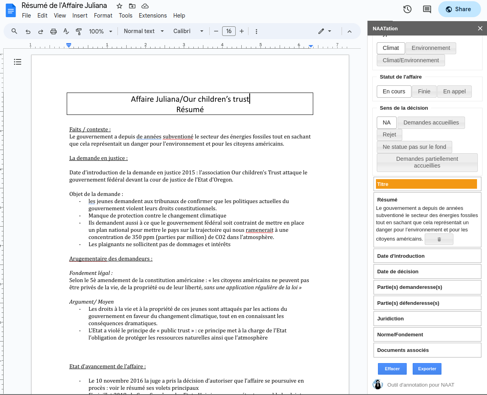

# Annotation tool for Google Doc™ (NAATation)

NAATation is a free Google Doc™ add-on that helps annotate climate/environmental litigation summaries on Google Doc™.

The following image is a screenshot of the add-on sidebar:

This add-on enables NAAT's volunteers to structure the information inside textual summaries of the climate trials.

With `NAATation` you can:
* select a piece of text
* annotate it by clicking on the desired attribute in the add-on's sidebar
* export the annotations in a given spreadsheet

## Privacy Policy

### About

This add-on is tightly integrated to your Google account and the data stored in the said account. When installing  the add-on from the Google Workspace Marketplace, you will be prompted to authorize different accesses to your Google account. Those authorizations will only be used to perform the service you are requesting from the add-on you have installed.

To remove the add-on access to your Google account, you must uninstall the add-on from the Google Workspace Marketplace. Add-ons are created and powered by Google Apps Script, on Google servers.

* Information gathered by `NAATation` will never be sold or shared to external people.
* `NAATation` does not sell in-app products nor advertise to its users (completely and will always be free).
* `NAATation` does not communicate with the user unless he or she has submitted an issue report/has emailed me.

Our App's use of information received, and App's transfer of information to any other app received from Google APIs will adhere to [Google API User Data Policy](https://developers.google.com/terms/api-services-user-data-policy), including the [Limited Use Requirements](https://developers.google.com/terms/api-services-user-data-policy#additional_requirements_for_specific_api_scopes).

### Data Access

When you install `NAATation`, you are asked to accept the following authorizations:
* see your primary Google Account email address (https://www.googleapis.com/auth/userinfo.email)
* see your personal info, including any personal info you've made publicly available (https://www.googleapis.com/auth/userinfo.profile)
* see, edit, create, and delete all your Google Docs documents (https://www.googleapis.com/auth/documents)
* permission to create a sidebar (https://www.googleapis.com/auth/script.container.ui)
* see, edit, create, and delete all your Google Sheets spreadsheets (https://www.googleapis.com/auth/spreadsheets)

Why does `NAATation` need those access scopes?
* **Google Docs**: to save the annotations into the properties of the Google Doc™
* **Google Sheets**: to exportsthe annotations into a single dedicated file
* **Sidebars**: to open `NAATation` as a sidebar in your Google applications

### Retention time
We only retain collected information for as long as necessary to provide you with your requested service. What data we store, we’ll protect within commercially acceptable means to prevent loss and theft, as well as unauthorized access, disclosure, copying, use or modification.

### Changes to this Privacy Policy
This Privacy Policy is subject to occasional revision, and we reserve the right to modify this Privacy Policy relating to `NAATation` at any time, effective upon posting of an updated version of this Privacy Policy.

## Terms and Conditions

These terms and conditions ("Agreement") sets forth the general terms and conditions of your use of the "NAATation" application ("Application", "Service", “App”, or “Add-on”) and any of its related products and services (collectively, "Services"). This Agreement is legally binding between you ("User", "you" or "your") and this Application developer ("Operator", "we", "us" or "our").

By accessing and using the Application and Services, you acknowledge that you have read, understood, and agree to be bound by the terms of this Agreement. If you are entering into this Agreement on behalf of a business or other legal entity, you represent that you have the authority to bind such entity to this Agreement, in which case the terms "User", "you" or "your" shall refer to such entity. If you do not have such authority, or if you do not agree with the terms of this Agreement, you must not accept this Agreement and may not access and use the Application and Services.

You acknowledge that this Agreement is a contract between you and the Operator, even though it is electronic and is not physically signed by you, and it governs your use of the Application and Services.

### Acceptance of Terms
You acknowledge that you have read this Agreement and agree to all its terms and conditions. By accessing and using the Application and Services you agree to be bound by this Agreement. If you do not agree to abide by the terms of this Agreement, you are not authorized to access or use the Application and Services.

Specifically, `NAATation` can only be installed from the Google Workspace Marketplace and when installing, Google will prompt you to accept this Agreement: “By clicking Continue, you acknowledge that your information will be used in accordance with the terms of service and privacy policy of this application.”

### Use of Service
If you create a Google account to use the Add-on, you are responsible for maintaining the security of your account and you are fully responsible for all activities that occur under the account and any other actions taken in connection with it. We will not be liable for any acts or omissions by you, including any damages of any kind incurred as a result of such acts or omissions.

We may suspend, disable, or delete your `NAATation` account (or any part thereof) if we determine that you have violated any provision of this Agreement or that your conduct or content would tend to damage our reputation and goodwill. If we delete your account for the foregoing reasons, you may not re-register for our Services. We may block your email address and Internet protocol address to prevent further registration.

### Prohibited Uses
In addition to other terms as set forth in the Agreement, you are prohibited from using the Add-on and Services or Content:

1. for any unlawful purpose;
2. to solicit others to perform or participate in any unlawful acts;
3. to violate any international, federal, provincial or state regulations, rules, laws, or local ordinances;
4. to infringe upon or violate our intellectual property rights or the intellectual property rights of others;
5. to harass, abuse, insult, harm, defame, slander, disparage, intimidate, or discriminate based on gender, sexual orientation, religion, ethnicity, race, age, national origin, or disability;
6. to submit false or misleading information;
7. to upload or transmit viruses or any other type of malicious code that will or may be used in any way that will affect the functionality or operation of the Application and Services, third party products and services, or the Internet;
8. to spam, phish, pharm, pretext, spider, crawl, or scrape;
9. for any obscene or immoral purpose;
10. to interfere with or circumvent the security features of the Application and Services, third party products and services, or the Internet.

We reserve the right to terminate your use of the Application and Services for violating any of the prohibited uses.

### Intellectual property rights
"Intellectual Property Rights" means all present and future rights conferred by statute, common law or equity in or in relation to any copyright and related rights, trademarks, designs, patents, inventions, goodwill and the right to sue for passing off, rights to inventions, rights to use, and all other intellectual property rights, in each case whether registered or unregistered and including all applications and rights to apply for and be granted, rights to claim priority from, such rights and all similar or equivalent rights or forms of protection and any other results of intellectual activity which subsist or will subsist now or in the future in any part of the world.

This Agreement does not transfer to you any intellectual property owned by the Operator or third parties, and all rights, titles, and interests in and to such property will remain (as between the parties) solely with the Operator. All trademarks, service marks, graphics and logos used in connection with the Application and Services, are trademarks or registered trademarks of the Operator or its licensors. Other trademarks, service marks, graphics and logos used in connection with the Application and Services may be the trademarks of other third parties. Your use of the Application and Services grants you no right or license to reproduce or otherwise use any of the Operator or third party trademarks.

### Changes and Amendments
These Terms are subject to occasional revision, and we reserve the right to modify this Agreement or its terms relating to the Add-on and Services at any time, effective upon posting of an updated version of this Agreement.

If your business or legal entity needs to be explicitly notified in case of changes to the terms, you may send an email to clement.brutti.mairesse@gmail.com to be added to our notification list.

### Disclaimer of Warranty
THE SERVICE IS PROVIDED ON AN “AS IS” BASIS, WITHOUT WARRANTIES OF ANY KIND, EITHER EXPRESS OR IMPLIED, INCLUDING, WITHOUT LIMITATION, IMPLIED WARRANTIES OF TITLE, MERCHANTABILITY, FITNESS FOR A PARTICULAR PURPOSE OR NON-INFRINGEMENT.

WE MAKE NO WARRANTY THAT:

1. THE SERVICE WILL BE ERROR-FREE OR UNINTERRUPTED (INCLUDING, WITHOUT LIMITATION, INTERRUPTIONS THAT OCCUR IN THE CONTEXT OF REGULARLY SCHEDULED MAINTENANCE);
2. ANY INFORMATION OR ADVICE OBTAINED BY YOU IN CONNECTION WITH THE SERVICE WILL BE ACCURATE OR COMPLETE; OR
3. THE RESULTS OF USING THE SERVICE WILL MEET YOUR REQUIREMENTS. SOME STATES DO NOT ALLOW EXCLUSION OF AN IMPLIED WARRANTY, SO THIS DISCLAIMER MAY NOT APPLY TO USERS.

## Contact Us
If you have any questions about these Privacy Policy or Terms and Conditions, you can contact us by visiting this page https://github.com/ClementBM/naatation/issues.